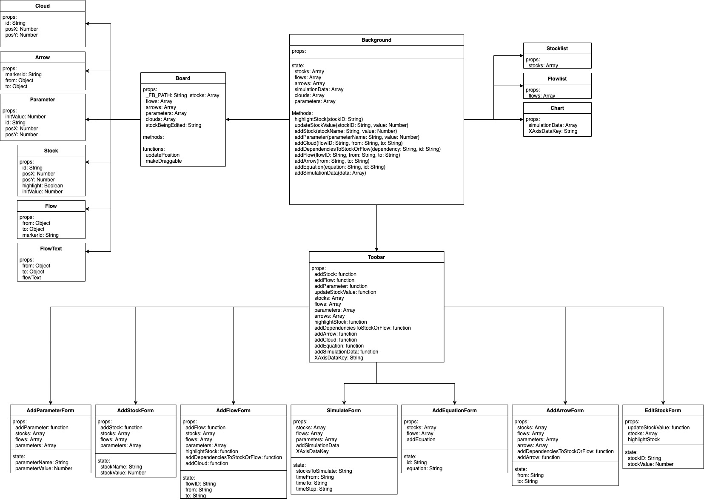
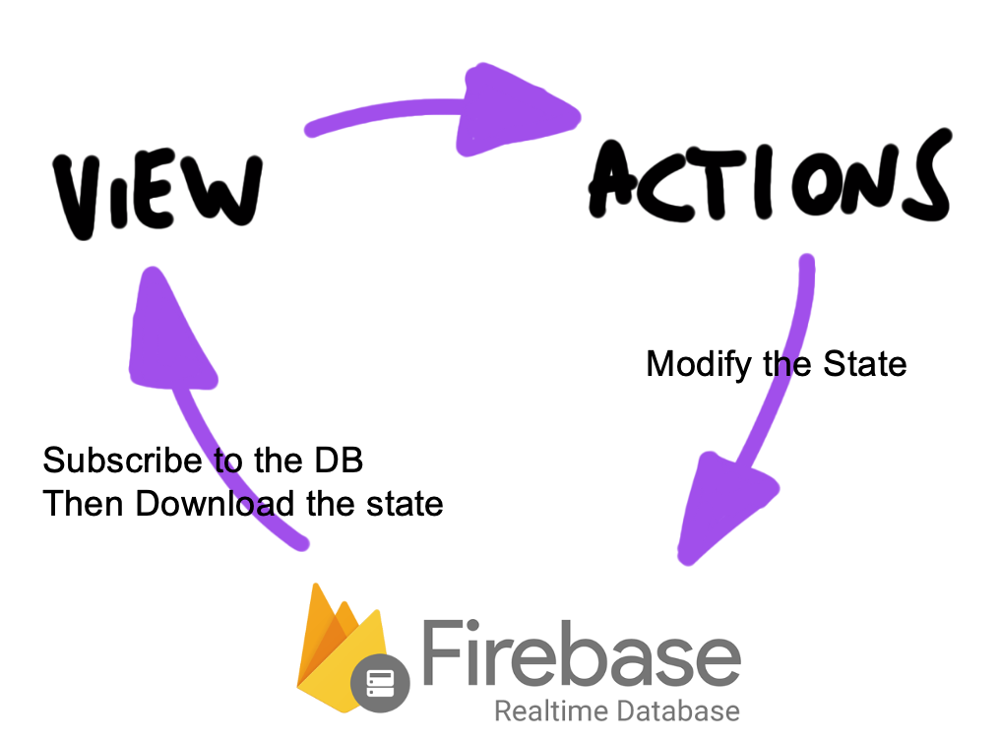

## CMPT405 Project - A Web-based System Dynamics Realtime Collaboration Tool

#### Table of Contents
1. [Motivation](#1-motivation)  
2. [Setup](#2-setup)  
    2.1. [Environment](#21-environment)  
    2.2. [npm packages](#22-npm-packages)  
    2.3. [firebase](#23-firebase)  
    2.4. [start](#24-start)  
3. [How To Use](#3-how-to-use)  
4. [Implementation](#4-implementation)  
    4.1. [React](#41-react)  
       &nbsp;&nbsp;4.1.1. [Components Description](#411-components-description)  
       &nbsp;&nbsp;4.1.2. [UML](#412-uml)  
    4.2. [Synchronization with `firebase`](#42-synchronization-with-firebase)  

### 1. Motivation
  1. The Current Software doesn’t support real-time collaboration (ex. Vensim)
  2. The goal is to create a web-based tool that supports 
    1. real-time collaboration: multiple clients can view/edit the same silumation in realtime.
    2. simulation: the system can run and visualize a System Dynamics simulation comprised of stocks, flows, and parameters.


### 2. Setup 
#### 2.1. environment
1. `node.js`>=`v10.16.3`
2. `npm`>=`6.9.0`


#### 2.2. npm packages
run `npm install` to install the packages
- [firebase](https://www.npmjs.com/package/firebase)  
- [mathjs](https://www.npmjs.com/package/mathjs)  
- [mathjs-simple-integral](https://www.npmjs.com/package/mathjs-simple-integral)  
- [react](https://www.npmjs.com/package/react)  
- [react-dom](https://www.npmjs.com/package/react-dom)  
- [react-scripts](https://www.npmjs.com/package/react-scripts)  
- [recharts](https://www.npmjs.com/package/recharts)  

#### 2.3. firebase 
This project depends on firebase Real-time database. A `config.js` file needs to be filled and put under the path `./src/config.js`.
The file needs to contain the following content
```javascript
var firebaseConfig = {
  apiKey: "api-key",
  authDomain: "project-id.firebaseapp.com",
  databaseURL: "https://project-id.firebaseio.com",
  projectId: "project-id",
  storageBucket: "project-id.appspot.com",
  messagingSenderId: "sender-id",
  appId: "app-id",
  measurementId: "G-measurement-id",
};
```
Read the [official instruction](https://firebase.google.com/docs/web/setup) for the complete guide on how to setup firebase

#### 2.4. start
Run `npm start` will start the web app at port `http://localhost:3000/`  

### 3. How To Use 

### 4. Implementation

#### 4.1. React 
##### 4.1.1. Components Description
- Background: The root component
  - Board: The diagramming area, which is a `svg` wrapper that contains the svg shapes
    - Cloud
    - Arrow
    - Parameter
    - Stock
    - Flow
    - FlowText
  - Toobar: The container for all the forms that add/modify/run the simulation
    - AddParameterForm
    - AddStockForm
    - AddFlowForm
    - SimulateForm: to set up variables for the simulation and submit a simulation run
    - AddEquationForm
    - AddArrowForm
    - EditStockForm
  - Stocklist: auxiliary view to display stock information
  - Flowlist: auxiliary view to display flow information
  - Chart: chart to display simulation result
##### 4.1.2. UML  


#### 4.2. Synchronization with `firebase`


- Firebase Real-time database is an essential part of the implementation. Real-time database serves as the state that lives on the cloud, which takes part in react framework's uni-directional dataflow.  
  
- User interactions trigger actions to invoke the methods to modify the state
  ```javascript
  firebase.database().ref('state/stocks').set(stocks);
  ```
- The view's local state subscrib to the cloud state and gets updated whenever the cloud state changes  
  (example: to a new stock)
  ```javascript
  const stateRef = firebase.database().ref('state');
  stateRef.on('value', (state) => {
    this.setState(state.val())
  })
  ```
#### 4.3. Calculation for simulation
#### 4.4. Area of Improvements

### 5. Testing
